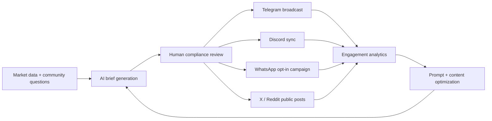

# Wisdom Atlas · eCNH API Ecosystem Guide

Global APIs × eCNH: a practical playbook for building a zero/low-cost AI + community distribution loop around **eCNH (Earth's Best CNH)** across Web3, RWA, Solana, and multilingual markets.

> **Important:** API quotas, pricing, model names, and platform rules change frequently. Treat the matrices below as a product strategy baseline and verify final quota/pricing from official provider documentation before production rollout.

## Navigation

- [Executive Summary](#executive-summary)
- [Recommended eCNH Stack](#recommended-ecnh-stack)
- [Social API Matrix](#social-api-matrix)
- [AI API Matrix](#ai-api-matrix)
- [Zero-Cost Promotion Closed Loop](#zero-cost-promotion-closed-loop)
- [Automated Daily Workflow](#automated-daily-workflow)
- [Global Distribution Matrix](#global-distribution-matrix)
- [Implementation Blueprint](#implementation-blueprint)
- [Risk, Compliance, and Guardrails](#risk-compliance-and-guardrails)
- [Roadmap](#roadmap)

## Executive Summary

The eCNH growth engine should prioritize **free/low-cost AI generation**, **community-first social distribution**, and **human-reviewed compliance**. The best near-term architecture is:

1. **AI analysis layer:** Gemini Flash-class model for multilingual market briefs, Groq-hosted Llama for fast summarization, and DeepSeek-class model for Chinese bilingual refinement.
2. **Community layer:** Telegram as the primary growth channel, Discord for Web3-native community operations, WhatsApp for emerging-market outreach, and X/Reddit for public discovery.
3. **Review layer:** human approval before publishing any financial, token, or market-sensitive claims.
4. **Measurement layer:** UTM tracking, post IDs, conversion tags, wallet/community joins, and daily performance reports.

### Key Metrics

| Area | Target Metric | Why it matters |
| --- | --- | --- |
| Social APIs | 10 priority channels | Broad distribution coverage without overbuilding early |
| AI APIs | 10 model/provider options | Reduces vendor lock-in and cost risk |
| Free/low-cost tier | 8+ usable options | Supports experimentation before paid scaling |
| Best eCNH fit | 6 core integrations | Keeps MVP focused and maintainable |

## Recommended eCNH Stack

### Free/Low-Cost AI Stack

| Role | Recommended option | Use case | Notes |
| --- | --- | --- | --- |
| Primary multilingual writer | Gemini Flash-class model | CN/EN/ES/PT/AR daily market brief generation | Strong default for multilingual public copy and web-context workflows |
| Fast summarizer | Groq-hosted Llama-class model | Low-latency headline, thread, and digest generation | Best for high-speed community responses and batch summaries |
| Chinese market editor | DeepSeek-class model | Chinese financial/CNH/RWA phrasing and bilingual polishing | Keep human review for compliance-sensitive wording |
| Premium reasoning fallback | GPT-4o/flagship reasoning model | Final QA, risk review, longer-form strategy | Use only where quality justifies cost |

### Free/Community Social Stack

| Channel | Priority | Best use | Recommendation |
| --- | --- | --- | --- |
| Telegram Bot | P0 | Fast community broadcast, Asia crypto audiences, group automation | Primary automated push channel |
| Discord Bot | P0 | Web3 community, roles, governance, support channels | Mirror Telegram content and collect feedback |
| WhatsApp Business | P1 | Asia, Africa, MENA, LATAM direct outreach | Use opt-in lists and template review flows |
| X / Twitter API | P1 | Public discovery, hashtags, influencer amplification | Avoid over-automation; prioritize high-quality scheduled posts |
| Reddit API | P2 | Long-form discussions, niche communities | Use educational posts; avoid spam-like promotion |
| YouTube Data API | P2 | Video briefs, Shorts metadata, education playlists | Pair with weekly explainers |
| LinkedIn API | P2 | RWA, fintech, institutional credibility | Best for compliance-oriented thought leadership |
| TikTok API | P3 | Short-form awareness | Use creator workflow before heavy API investment |
| Instagram Graph API | P3 | Visual snippets and reels | Repurpose concise chart/image posts |
| WeChat | Manual/partner | Chinese private community reach | Treat as manual/partner workflow unless approved automation is available |

## Social API Matrix

| Rank | API | Free/low-cost potential | eCNH fit | Primary value | Caution |
| --- | --- | --- | --- | --- | --- |
| 1 | Telegram Bot API | High | Excellent | Broadcast, group ops, bot commands | Rate limits and anti-spam rules still apply |
| 2 | Discord API | High | Excellent | Web3 community management | Requires moderation and role design |
| 3 | WhatsApp Business Platform | Medium | High | Direct opt-in outreach | Template, consent, and regional compliance matter |
| 4 | X API | Medium/Low | High | Public narratives and hashtags | Pricing/access changes often; avoid dependency |
| 5 | Reddit API | Medium | Medium | Education and community discussions | Subreddit rules vary widely |
| 6 | YouTube Data API | Medium | Medium | Video discovery and educational content | Quota planning required |
| 7 | LinkedIn API | Medium/Low | Medium | RWA/fintech credibility | API access is limited by use case |
| 8 | Instagram Graph API | Medium | Medium | Visual distribution | Requires Meta app review and account setup |
| 9 | TikTok API | Medium/Low | Experimental | Youth-market short video | API access and policies vary by region |
| 10 | WeChat ecosystem | Low/manual | High for Chinese community | Private community conversion | Automation requires compliant, approved paths |

## AI API Matrix

| Rank | Provider/model class | Free/low-cost potential | eCNH fit | Best use | Caution |
| --- | --- | --- | --- | --- | --- |
| 1 | Gemini Flash-class | High | Excellent | Multilingual market briefs, translation, public copy | Verify search/tooling availability per plan |
| 2 | Groq Llama-class | High | High | Fast summaries, Discord/Telegram responses | Watch context length and model availability |
| 3 | DeepSeek-class | High/Medium | High | Chinese bilingual financial phrasing | Human review required for claims |
| 4 | OpenAI GPT-4o/flagship | Medium | Excellent | Final QA, safety review, premium content | Use selectively to control cost |
| 5 | Anthropic Claude-class | Medium | High | Long-form analysis and policy-sensitive editing | Pricing and rate limits vary by model |
| 6 | Mistral-class | Medium | Medium | EU-friendly model diversification | Verify language quality for target markets |
| 7 | Perplexity/search-answer API | Medium | Medium | Source-aware current event briefs | Must cite and verify source quality |
| 8 | xAI/Grok-class | Medium/Low | Medium | X-native trend interpretation | Treat as optional enrichment |
| 9 | Cohere-class | Medium | Medium | Retrieval, classification, embeddings | Best for knowledge-base workflows |
| 10 | Local/open-source models | High after setup | Medium | Cost-controlled internal tasks | Requires ops, GPUs, and monitoring |

## Zero-Cost Promotion Closed Loop



### Daily Content Loop

1. Collect market signals, CNH/RWA/Solana news, community questions, and prior post analytics.
2. Generate a bilingual **CN + EN eCNH market brief** with a free/low-cost AI model.
3. Produce localized variants for Arabic, Spanish, Portuguese, and other target regions.
4. Run a compliance checklist before publishing.
5. Push approved content to Telegram and Discord first.
6. Repurpose the same core brief into WhatsApp, X, Reddit, LinkedIn, and video script formats.
7. Measure clicks, replies, joins, wallet actions, and conversion quality.
8. Feed performance data back into tomorrow's prompt and channel plan.

## Automated Daily Workflow

| Step | Automation | Owner | Output |
| --- | --- | --- | --- |
| 1 | Fetch market/community inputs | Cron + API jobs | Raw signal bundle |
| 2 | Generate brief | AI orchestration service | Draft CN/EN market note |
| 3 | Safety and claim check | AI + human reviewer | Approved or rejected content |
| 4 | Telegram push | Telegram Bot API | Group/channel post |
| 5 | Discord sync | Discord bot/webhook | Community announcement |
| 6 | WhatsApp outreach | WhatsApp Business workflow | Opt-in message campaign |
| 7 | X/Reddit post | Scheduler | Public discovery content |
| 8 | Analytics report | Dashboard job | Daily performance digest |

## Global Distribution Matrix

| Audience | Channels | AI support | Content style |
| --- | --- | --- | --- |
| Chinese community | Telegram + WeChat/manual + Chinese-language AI editor | DeepSeek-class bilingual refinement | CNH education, RWA credibility, concise market context |
| English Web3 community | Discord + X + Reddit + GPT/Claude QA | Flagship reasoning QA | Solana, liquidity, transparency, technical explainers |
| Asia/Africa/MENA | WhatsApp + Telegram + Gemini multilingual | Arabic/English localized summaries | Mobile-first, direct, simple call-to-action |
| LATAM/Portuguese markets | WhatsApp + X + Instagram | Spanish/Portuguese localization | Education, community trust, simple onboarding |
| Institutional/RWA audience | LinkedIn + long-form site content | Claude/GPT-style editorial review | Compliance-first, risk-aware, evidence-backed |

## Implementation Blueprint

### Suggested Repository Structure

```text
src/
  jobs/
    dailyBrief.ts
    analyticsDigest.ts
  integrations/
    ai/
      gemini.ts
      groq.ts
      deepseek.ts
      openai.ts
    social/
      telegram.ts
      discord.ts
      whatsapp.ts
      x.ts
  prompts/
    marketBrief.md
    complianceReview.md
  services/
    contentPipeline.ts
    approvalQueue.ts
  config/
    channels.ts
    locales.ts
```

### Environment Variables

```bash
# AI providers
GEMINI_API_KEY=
GROQ_API_KEY=
DEEPSEEK_API_KEY=
OPENAI_API_KEY=

# Social platforms
TELEGRAM_BOT_TOKEN=
DISCORD_BOT_TOKEN=
WHATSAPP_ACCESS_TOKEN=
WHATSAPP_PHONE_NUMBER_ID=
X_API_KEY=
X_API_SECRET=
REDDIT_CLIENT_ID=
REDDIT_CLIENT_SECRET=

# Ops
APPROVAL_WEBHOOK_URL=
ANALYTICS_DATABASE_URL=
UTM_BASE_URL=
```

### Core Content JSON Contract

```json
{
  "id": "2026-05-10-ecnh-daily-brief",
  "topic": "eCNH market brief",
  "languages": ["zh-CN", "en", "ar", "es", "pt"],
  "riskLevel": "medium",
  "requiresHumanApproval": true,
  "claims": [
    {
      "text": "eCNH is positioned around AI + RWA + Web3 + Solana narratives.",
      "source": "internal positioning",
      "approved": true
    }
  ],
  "channels": ["telegram", "discord", "whatsapp", "x", "reddit"],
  "hashtags": ["ECNH", "EarthsBestCNH", "RWA", "Solana"],
  "callToAction": "Join the eCNH community and follow the daily market brief."
}
```

## Risk, Compliance, and Guardrails

- **No investment advice:** avoid promises, guaranteed returns, price predictions, or misleading scarcity claims.
- **Human approval:** require review for financial claims, tokenomics, exchange listings, regulatory statements, and partnership claims.
- **Consent-first outreach:** WhatsApp, email, and private-message workflows must be opt-in and easy to unsubscribe from.
- **Anti-spam posture:** prefer fewer high-quality posts over aggressive automation.
- **Source discipline:** current market or policy claims must include timestamped sources.
- **Regional localization:** adapt wording for local expectations instead of directly translating hype language.
- **Fallback plan:** if a paid API becomes unavailable or expensive, route through Telegram/Discord + free AI provider first.

## Prompt Templates

### Daily Market Brief Prompt

```text
You are the eCNH market brief editor.
Create a concise bilingual market update for a global Web3/RWA community.

Inputs:
- Market signals: {{market_signals}}
- Community questions: {{community_questions}}
- Previous post analytics: {{analytics}}
- Required hashtags: #ECNH, #EarthsBestCNH, #RWA, #Solana

Rules:
- Output Chinese first, then English.
- Do not provide investment advice.
- Do not make price predictions.
- Mark uncertain claims as "needs verification".
- Include one clear community CTA.
```

### Compliance Review Prompt

```text
Review the draft for financial promotion risk.
Return JSON with:
- approved: boolean
- risk_level: low | medium | high
- issues: string[]
- required_edits: string[]
- safer_version: string

Reject content that includes guaranteed returns, unverifiable partnerships,
unsupported listing claims, or direct investment instructions.
```

## Roadmap

### Phase 1 — MVP Distribution (Week 1-2)

- Launch Telegram and Discord bots.
- Generate one bilingual daily market brief.
- Add manual approval before posting.
- Track basic engagement: views, reactions, replies, joins, clicks.

### Phase 2 — Multilingual Growth (Week 3-6)

- Add WhatsApp opt-in broadcasts.
- Localize content into Arabic, Spanish, and Portuguese.
- Build a reusable prompt library.
- Start weekly analytics review.

### Phase 3 — Public Discovery (Week 7-10)

- Add X, Reddit, LinkedIn, and YouTube content repurposing.
- Build hashtag and topic performance reports.
- Create creator/influencer collaboration workflow.
- Add A/B tests for hooks, CTAs, and posting windows.

### Phase 4 — Scalable API Operations (Week 11+)

- Add provider fallback routing.
- Add queue-based publishing and retries.
- Add compliance audit logs.
- Add dashboard for cost, quota, channel growth, and conversions.

## Brand Footer

**#ECNH · Earth's Best CNH · AI + RWA + Web3 · Solana**

Contract Address:

```text
7GQnqthWKa5v2GqXYWhmgWZY5mCRrniwK3Xuinm9GKw5
```

Data should be sourced from official platform documentation before launch. Prices, free tiers, quotas, and access policies may change without notice.
